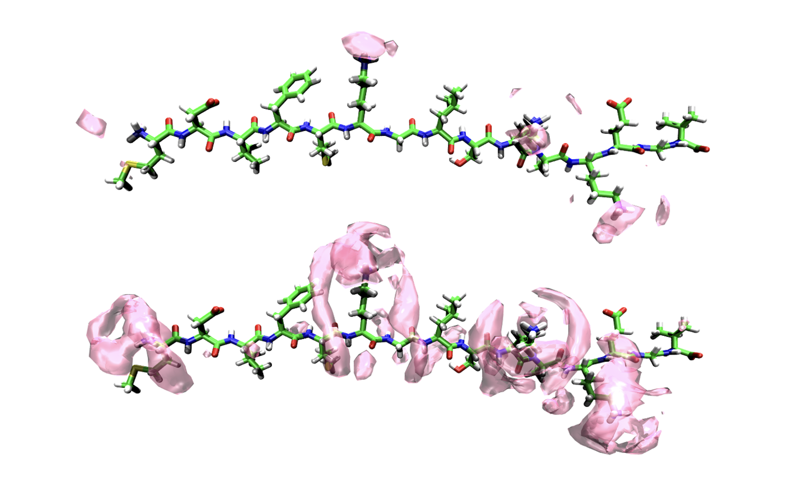
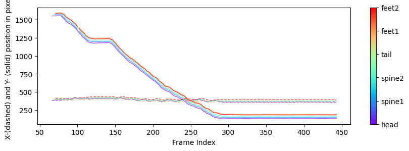
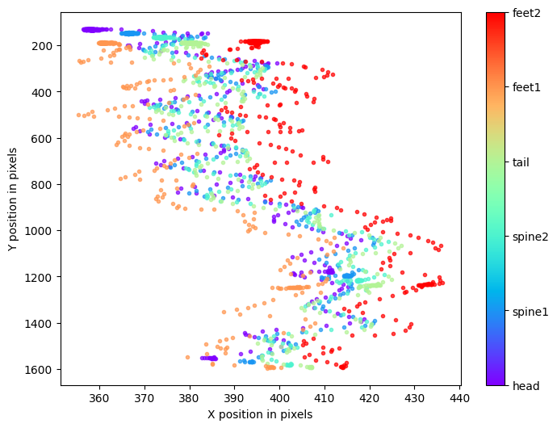

This page summarized my main project in chem/bio informatics

## Molecular Dynamics On Peptides and small molecules 
 
Peptides and small proteins serve as models to study the interactions of salts and buffers with biomolecules related on protein secondary and tertiary structures and downstream physicochemical properties. These studies utilize intrinsically disordered peptides, such as N-terminal segments from amyloid proteins. We employ methods including MD simulations, NMR spectroscopy, calorimetry, optical instrucments light scattering/CD spectroscopy. Below is a visualization of a peptide with an associated anion cloud from MD results.  

## Lizard Pose Estimation and Evaluation
 
 This project in on landmark detection and recognition of moving animals as Lizard. Below is the recognition video from DLC. 
### Video output 

Here is the annotated video generated by trained model:

### Trajectory plot 

Bodyparts of all trajectories in test videos were shown:

